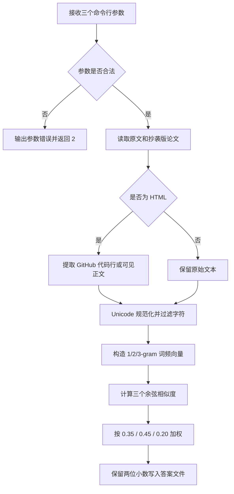

# 计算模块设计与实现说明

## 一、代码组织

项目采用单文件入口，运行时不依赖第三方库，确保只读取命令指定的两个输入文件，
并只写入指定的答案文件。

| 名称 | 职责 |
|---|---|
| `ArgumentError` | 表示命令行参数错误 |
| `InputFileError` | 表示输入文件读取、解码或 HTML 解析错误 |
| `OutputFileError` | 表示答案文件写入错误 |
| `DocumentHTMLParser` | 从普通 HTML 或 GitHub blob 页面提取正文 |
| `looks_like_html` | 判断输入是否为 HTML |
| `extract_document_text` | 返回纯文本或 HTML 中的论文正文 |
| `normalize_text` | 统一字符宽度和英文大小写，去除标点和空白 |
| `iter_ngrams` | 依次生成 1/2/3-gram 字符片段 |
| `cosine_similarity` | 计算两个词频向量的余弦相似度 |
| `calculate_similarity` | 计算最终加权重重复率 |
| `read_text` | 读取 UTF-8 或 GB18030 文本 |
| `write_score` | 将两位小数结果写入答案文件 |
| `parse_arguments` | 校验三个命令行路径 |
| `main` | 组合执行流程并转换为退出码 |

## 二、算法流程



## 三、HTML 正文提取

题目样式中包含 GitHub blob 页面。真正的论文内容位于带有
`blob-code`、`js-file-line` 或 `id="LC..."` 的行中。

`DocumentHTMLParser` 的行为：

- 优先收集 GitHub blob 的代码行。
- 对普通 HTML 收集可见文本。
- 跳过 `script`、`style`、`noscript` 中的内容。
- 忽略 `br`、`img`、`meta` 等不影响正文的标签。
- 如果文件中没有 GitHub 代码行，则回退到普通 HTML 可见文本。

## 四、相似度算法

文本规范化后，分别构造 1-gram、2-gram 和 3-gram 的频次向量，再计算余弦相似度。

```text
score = 0.35 × cosine(1-gram)
      + 0.45 × cosine(2-gram)
      + 0.20 × cosine(3-gram)
```

权重设计原因：

- 1-gram 对插入、删除和换序较稳定，但区分度较低。
- 2-gram 能较好反映局部连续文本，作为主要特征。
- 3-gram 对顺序更敏感，用于辅助区分高度相似文本。

该方法不需要分词，也不依赖外部词典，时间复杂度接近线性，适合约一万字符
的论文文本。

## 五、边界规则

- 两篇文本都为空时，重复率为 `1.00`。
- 只有一篇为空时，重复率为 `0.00`。
- 完全相同文本会被修正为严格的 `1.0`，避免浮点误差产生
  `0.9999999999999999`。