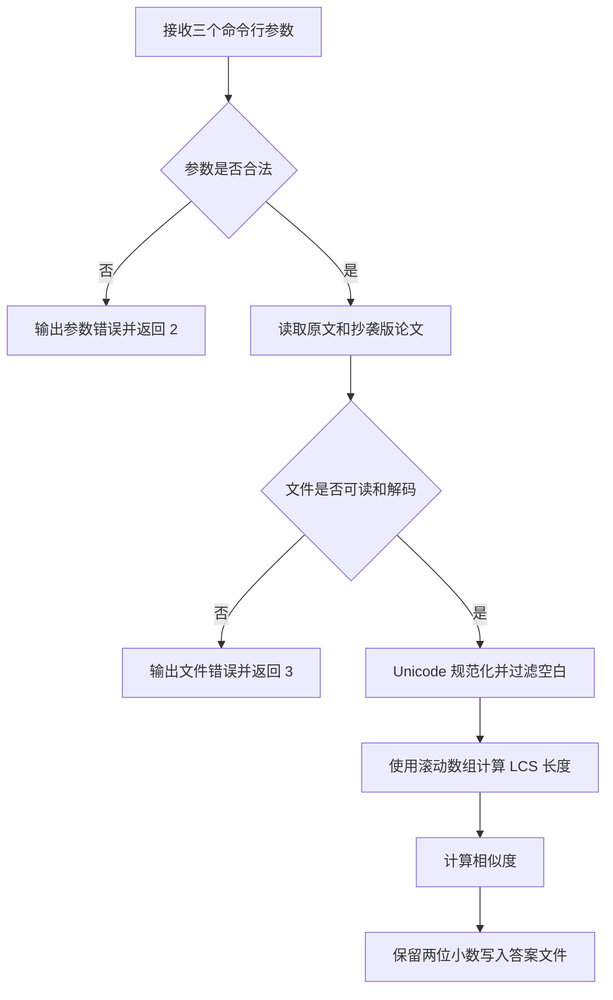

# 计算模块设计与实现说明

## 一、代码组织

项目采用单文件入口，运行时不依赖第三方库，确保只读取命令指定的两个输入文件，
并只写入指定的答案文件。

| 名称 | 职责 |
|---|---|
| `ArgumentError` | 表示命令行参数错误 |
| `InputFileError` | 表示输入文件读取或解码错误 |
| `OutputFileError` | 表示答案文件写入错误 |
| `normalize_text` | 执行 Unicode 规范化、英文大小写统一和空白过滤 |
| `longest_common_subsequence_length` | 计算 LCS 长度 |
| `calculate_similarity` | 根据 LCS 计算重复率 |
| `read_text` | 读取 UTF-8 或 GB18030 文本 |
| `write_score` | 将两位小数结果写入答案文件 |
| `parse_arguments` | 校验三个命令行路径 |
| `main` | 组合执行流程并转换为退出码 |

## 二、算法流程



## 三、相似度公式

```text
similarity = 2 × LCS(original, suspect) / (len(original) + len(suspect))
```

该公式具有以下特点：

- 取值范围为 `[0, 1]`。
- 两篇完全相同的文本结果为 `1.00`。
- 没有公共字符的文本结果为 `0.00`。
- 对插入、删除和替换具有稳定的惩罚效果。
- 结果关于两个输入顺序对称。

## 四、性能设计

LCS 使用两行滚动数组，而不是保存完整二维矩阵，空间复杂度由
`O(m × n)` 降低为 `O(min(m, n))`。测试文本最大长度为 500，因此算法
在时间和内存方面都有充足余量。

## 五、关键取舍

- 保留中文标点参与计算，使“原文修改标点”也能反映在结果中。
- 忽略空白字符，避免换行和排版空格影响结果。
- 英文大小写不敏感，全角字符先转换成标准形式。
- 运行时不引入 `jieba`、`gensim` 等第三方依赖，减少安装和评测风险。